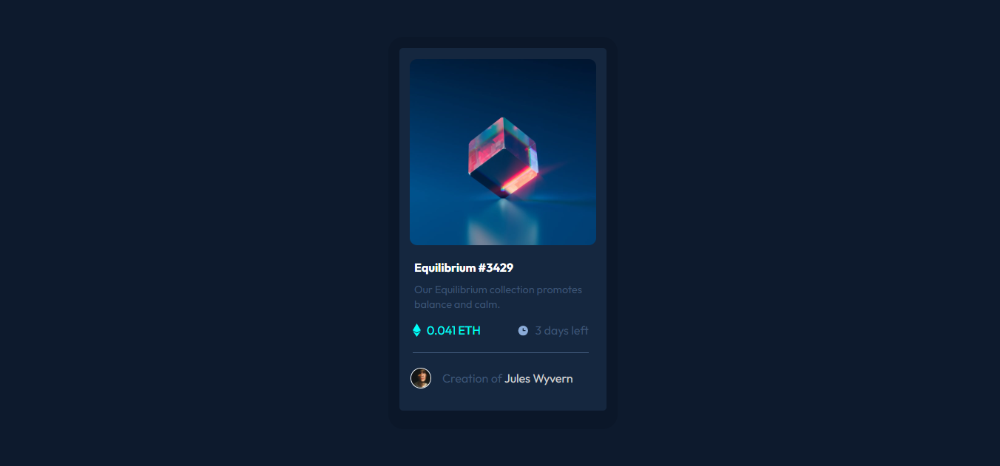

# Frontend Mentor - NFT preview card component

This is a solution to the [Social links profile challenge on Frontend Mentor](https://www.frontendmentor.io/challenges/nft-preview-card-component-SbdUL_w0U).  
Frontend Mentor challenges help you improve your coding skills by building realistic projects.

---

## 📸 Screenshot



---

## 🔗 Links

- **Solution URL:** [](#)
- **Live Site URL:** [https://fransantos103.github.io/Easy-Challenge---NFT-preview-card-component/](#)

---

## 💻 My process

### Built with
- Semantic **HTML5** markup  
- **CSS3** (Flexbox, hover states, custom fonts)  
- Responsive design principles  

---

## 🧠 What I learned

While working on this project, I reinforced my understanding of:
- Using **semantic HTML** (`<main>`, `<article>`)
- Creating **centered layouts** with Flexbox  
- Designing **consistent color palettes and hover effects**

Here’s a little code snippet I’m proud of:

```css
.overlay {
  position: absolute;
  top: 6%;
  left: 5%;
  width: 260px;
  max-width: 90%;
  height: 94%;
  border-radius: 10px;
  background-color: rgba(0, 255, 247, 0.5); 
  display: flex;
  justify-content: center;
  align-items: center;
  opacity: 0; 
  transition: opacity 0.2s ease;
}
